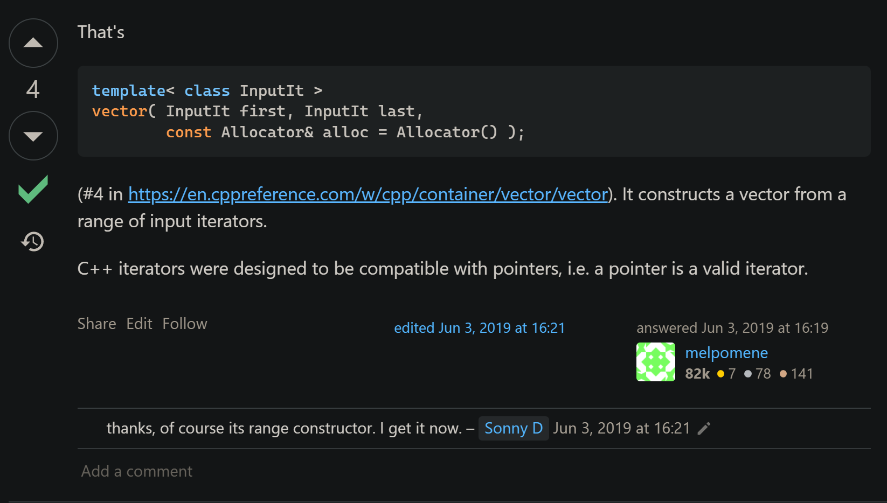
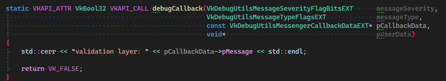
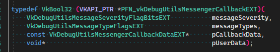

# VulkanTutorial

`pAllocator` is always `nullptr` in this tutorial


# Validation layers

```c++
std::vector<const char*> getRequiredExtensions()
{
    uint32_t     glfwExtensionCount = 0;
    const char** glfwExtensions;
    glfwExtensions = glfwGetRequiredInstanceExtensions(&glfwExtensionCount);
	
    // what the heck is this?
    std::vector<const char*> extensions(glfwExtensions, glfwExtensions + glfwExtensionCount);

    if (enableValidationLayers)
    {
        extensions.push_back(VK_EXT_DEBUG_UTILS_EXTENSION_NAME);
    }

    return extensions;
}
```

https://stackoverflow.com/questions/56430948/which-stdvector-constructor-is-used-here



---

By saying:

> Add a new static member function called `debugCallback` **with the `PFN_vkDebugUtilsMessengerCallbackEXT` prototype**,

they mean our function:



 has the following signature (defined in `vulkan_core.h`): 



---

